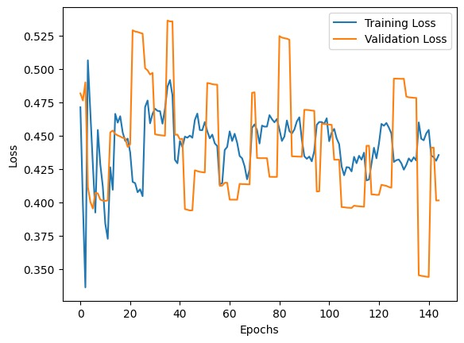
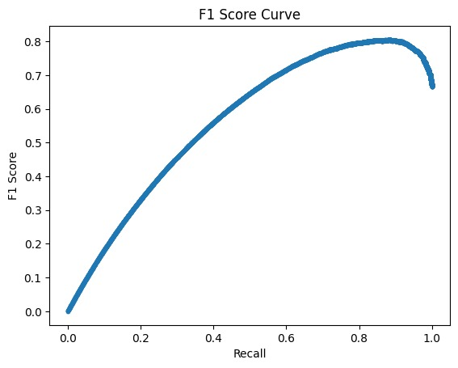
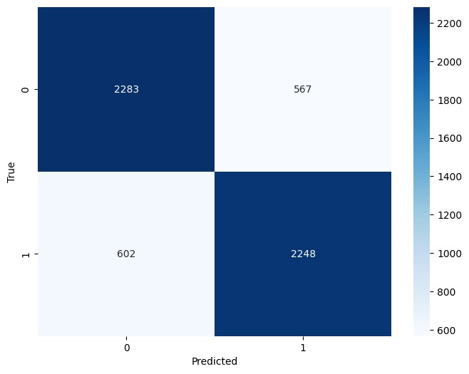
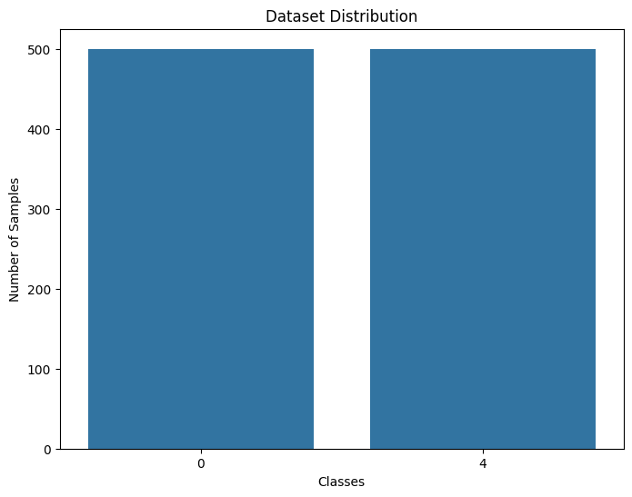

# Model Training Report

**Executive Summary**

- **Project**: Twitter sentiment classification using DistilBERT-style transformer models.
- **Model(s)**: `TFDistilBertForSequenceClassification` (trained checkpoints in `Models/chunk_model1`, `Models/chunk_model2` and `Trained_weights/chunk_model1.h5`).
- **Primary artifacts**: model checkpoints, training notebook `Notebooks/DistillBert_Model.ipynb`, evaluation figures in `Report/Figures/`.

**Data**

- **Source files**: cleaned and chunked training CSVs under `Data/processed/Chunks/` and `Data/raw/train.csv`.
- **Label mapping**: mapping used in utilities maps raw Twitter labels `{0, 4}` into binary labels `{0,1}` (`utils.load_dataframe` performs `df['target'] = df['target'].map({0: 0, 4: 1})`).
- **Notes**: dataset is split/processed into chunks (see `Data/processed/Chunks/chunk_*.csv`) presumably for memory-efficient training.

**Preprocessing**

- **Text cleaning**: user mentions replaced with `@user`, URLs removed, hashtags converted to token text, and whitespace normalized (see `entry_main.clean_text`).
- **Tokenization**: uses `transformers.AutoTokenizer` in `Notebooks/utils.py` (`load_tokenizer('distilbert-base-uncased')`).
- **Tokenization settings**: `entry_main` inference uses `padding='max_length'`, `truncation=True`, and `max_length=128`.

**Model Architecture**

- **Base model**: DistilBERT (a distilled BERT variant) via `transformers`' `TFDistilBertForSequenceClassification`.
- **Output**: single logit (binary classification). Inference code applies `tf.nn.sigmoid` to logits and thresholds at `0.5` to produce `positive`/`negative` labels.

**Training Procedure (overview)**

- **Where to find full training details**: the training notebook `Notebooks/DistillBert_Model.ipynb` contains the code used for training, including exact hyperparameters (epochs, batch size, optimizer, learning rate schedule). Refer to that notebook for step-by-step reproductions.
- **Checkpoints**: checkpoints saved under `Models/chunk_model1` and `Models/chunk_model2` (each containing `config.json` + weights). There is also `Trained_weights/chunk_model1.h5`.

**Evaluation & Results**

- **Figures**: the evaluation plots are saved in `Report/Figures/` and are embedded below. These include training/validation loss, precision-recall, F1 curve, and confusion matrix.

Training Loss vs. Validation Loss



Precision-Recall Curve


F1 Score Curve



Confusion Matrix



Sample model outputs / prediction snapshot



- **Interpretation guidance**: use the precision-recall and F1 plots to choose an operating threshold if you wish to prioritize precision or recall. The confusion matrix provides an at-a-glance view of common error types (false positives vs false negatives).

**Reproducibility & Environment**

- **Python dependencies**: see `backend/requirements.txt`. Important packages include `tensorflow`, `transformers`, `fastapi`, `uvicorn`, `pandas`, `scikit-learn`, `matplotlib`, and `seaborn`.
- **Docker**: a `backend/Dockerfile` and `backend/start.sh` have been added to the repo to containerize the FastAPI inference service. The container exposes port `8080` and launches `uvicorn entry_main:app`.
- **Files required at runtime**: be sure to include `Models/chunk_model2` (or mount it at runtime) inside the container; otherwise the model load at startup will fail.

**Deployment Notes (Hugging Face Spaces or other container hosts)**

- **Hugging Face Spaces (Docker)**: push the project including the `backend/` Dockerfile and model artifacts (or host model weights separately and mount them). Ensure large model files are within the size limits or use the Hugging Face Hub to host large model files and download them at container start.
- **Example: build and run locally (PowerShell)**

```powershell
cd backend
docker build -t twitter-sentiment-backend:latest .
docker run -p 8080:8080 --rm -e PORT=8080 -v "<local_model_path>:/app/Models/chunk_model2" twitter-sentiment-backend:latest
```

- **Push model to the Hugging Face Hub** (optional, recommended for Spaces or hosted inference):

1. Install `huggingface_hub` and log in:

```bash
pip install huggingface_hub
huggingface-cli login
```

2. From a training script or notebook, push the tokenizer and model (example):

```python
from transformers import AutoTokenizer, TFDistilBertForSequenceClassification
tokenizer = AutoTokenizer.from_pretrained('distilbert-base-uncased')
model = TFDistilBertForSequenceClassification.from_pretrained('./Models/chunk_model2')
model.push_to_hub('your-username/twitter-sentiment-distilbert')
tokenizer.push_to_hub('your-username/twitter-sentiment-distilbert')
```

**Limitations & Caveats**

- **Hardware**: current images / requirements assume CPU-only or standard x86 Linux containers. If you need GPU acceleration, install a CUDA-enabled TensorFlow build and use GPU-enabled base images — Hugging Face Spaces has specific guidance for GPU-backed Spaces.
- **Model size & repo limits**: large checkpoints may exceed Git or Spaces limits; prefer the Hugging Face Hub or external storage and download at startup.
- **Missing explicit hyperparameters**: exact training hyperparameters are not embedded in `entry_main.py` or `utils.py` — inspect `Notebooks/DistillBert_Model.ipynb` for the definitive training run settings.

**Next steps & Recommendations**

- **Add training metadata**: save a `training-config.json` alongside checkpoints with hyperparameters, dataset split ratios, and random seeds to make experiments fully reproducible.
- **Provide a small reproducible run**: include a minimal dataset subset and a short training script for CI-style verification.
- **Add automated evaluation**: a small script that loads a checkpoint and computes evaluation metrics on a holdout test set, outputting a machine-readable report (CSV/JSON) in `Report/`.
- **Model monitoring**: if deploying to production, add logging of input texts (anonymized) and prediction confidence to monitor drift.

---

**Files & Locations (quick reference)**

- **Training notebook**: `Notebooks/DistillBert_Model.ipynb`
- **Utility functions**: `Notebooks/utils.py`
- **Inference app**: `entry_main.py` (FastAPI)
- **Container files**: `backend/Dockerfile`, `backend/start.sh`, `backend/requirements.txt`
- **Models**: `Models/chunk_model1/`, `Models/chunk_model2/`, `Trained_weights/chunk_model1.h5`
- **Figures**: `Report/Figures/` (embedded above)

If you want, I can:

- run a quick Python syntax check across the `backend` files, and/or
- build and run the Docker image locally to verify the service starts, and/or
- extract training hyperparameters and a short reproducible script from `Notebooks/DistillBert_Model.ipynb` and add a `training-config.json` next to the checkpoints.

Report generated and saved to `Report/Model_Training_Report.md`.
